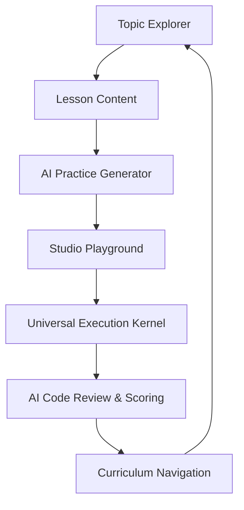

# 🎓 Learning Hub Studio: Local Edition

> A premium, AI-powered developer learning engine for mastering modern stacks on your local machine.

Learning Hub Studio is not just a curriculum—it's a sophisticated **Pedagogical Loop** designed to bridge the gap between "watching a tutorial" and "writing production code." 🚀

## 🧠 Why I Built This
Most online learning platforms stop at "hello world." I wanted to build a system that actively challenges you to solve real-world problems. By integrating a local Gemini-powered AI teacher, this hub doesn't just show you code—it evaluates your logic, identifies architectural gaps, and pushes you to think like a senior engineer.


---

## ✨ Key Features

- **🛡️ Studio Dimmed UI**: A professional, VS Code-inspired interface designed for deep focus and long learning sessions. High-contrast typography with `Outfit` and `JetBrains Mono`.
- **🔄 The AI Learning Loop**: 
  - **Learn**: Deep dives into TS, Docker, CI/CD, and System Design.
  - **Generate**: One-click **AI Practice Lab** generation tailored to the specific lesson.
  - **Solve**: Integrated **Studio Sandbox** with real-time feedback and a **live-running timer**.
  - **Evaluate**: Automated AI grading with heatmaps of your strengths and gap analysis.
- **📂 Search & Navigation**:
  - **Premium Explorer**: Sidebar with nested topics and mastery tracking.
  - **Fuzzy Search**: Real-time, debounced search across all lesson titles and body content with visual highlighting.
- **📈 Stats Dashboard**:
  - **Learning Analytics**: Visual performance tracking using `recharts`.
  - **Growth Curve**: Interactive Area Charts showing score history.
  - **Metric Tiles**: At-a-glance mastery percentages and topic proficiency bars.
- **🚀 Foundational Mission**: A dedicated "Start Here" roadmap for beginners to ensure mastery of baseline dependencies (Git, Linux, JS) before proceeding.
- **🎯 DSA Milestone Track**: A parallel 3-tier track (Foundations, Mastery, Expert) with automated practice prompts triggered every 3 topics completed.

---

## 🏗️ The Architecture

The "Learning Loop" is powered by a coordinated Frontend/Backend bridge:



---

## 🛠️ Technology Stack

- **Frontend**: React 18, Vite, TypeScript, Lucide Icons, HSL Design Tokens.
- **Backend**: Node.js, Express, Google Gemini (Flash 2.0).
- **Data**: Centralized JSON Curriculum & Lesson Vault.

---

## 🚀 Getting Started

### 1. Prerequisites
- Node.js (v18+)
- A Google AI (Gemini) API Key

### 2. Installation
```bash
# Clone the repository
git clone https://github.com/purushothaman-web/learning-hub-studio.git
cd learning-hub-studio

# Install dependencies for both Frontend & Backend
cd backend && npm install
cd ../frontend && npm install
```

### 3. Setup
Create a `.env` file in the `backend/` directory:
```env
GEMINI_API_KEY=your_key_here
PORT=5000
```

### 4. Launch
```bash
# Start the Backend (Terminal 1)
cd backend && node server.js

# Start the Frontend (Terminal 2)
cd frontend && npm run dev
```
Navigate to `http://localhost:5173` to start your journey.

---

## 📚 The Road to Mastery: Curriculum Tiers

The curriculum is structured into three distinct tiers to guide your growth from zero to senior engineer.

### 🥉 Foundations (Level 1-10)
- **HTML/CSS Basics**: Beyond div-soup to semantic layouts.
- **JavaScript Essentials**: Async patterns, Closures, ESM.
- **React Foundations**: Props, State, Effects, and the Component Lifecycle.
- **TypeScript Depth**: Moving from 'any' to robust type safety.

### 🥈 Mastery (Level 11-50)
- **Web Security**: CSRF, XSS, JWT, and Secure Headers.
- **Testing Excellence**: Unit, Integration, and E2E patterns.
- **Docker Mastery**: Layers, Caching, and Multi-stage builds.
- **CI/CD Pipelines**: Automated deployments with GitHub Actions.
- **PostgreSQL & Redis**: Advanced queries and efficient caching.
- **Node.js & React Architecture**: Professional-grade system design.

### 🥇 Expert & AI (Level 51-100)
- **System Design**: Scaling, Microservices, and CAP Theorem.
- **AI Orchestration**: Building with Gemini, RAG, and Agents.
- **Performance & Observability**: Core Web Vitals, Distributed Tracing (OpenTelemetry), and SQL Optimization (EXPLAIN ANALYZE).
- **Cloud Deployment**: Infrastructure as Code (IaC) with Terraform and Cloud Arch.

### 🏆 DSA Track (Algorithmic Mastery)
- **Foundations**: Complexity analysis (Big O), Arrays, Strings, Fast & Slow Pointers.
- **Mastery**: Trees, Binary Search Trees, Heaps, Graphs (BFS/DFS), and DP Intro.
- **Expert**: Advanced DP (Bitmask/Knapsack), Tries, Segment Trees, and Shortest Paths.

---
*Built with ❤️ for rapid developer growth.*
